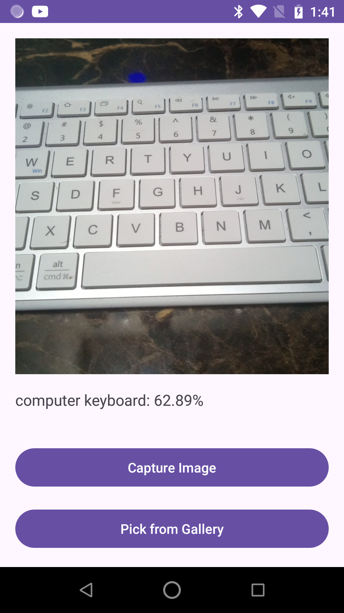

# Image Classification - TensorFlow Lite (Kotlin)

This module adds **on-device image classification** to the Android app using TensorFlow Lite.  
Users can **snap a photo or pick one from the gallery**; the app then runs the `mobilenet_quant_v1_224.tflite` model on the image and displays the top predictions with confidence scores.

---

## ✨ Features
- **TensorFlow Lite Vision API** with optional **GPU delegate** for faster inference.  
- Pre-trained **MobileNet V1 (224 × 224, quantized)** for ImageNet classes.  
- Runtime **camera & storage permission** handling.  
- Seamless **camera capture** via `ActivityResultContracts.TakePicture()` and **gallery picker** via `ActivityResultContracts.GetContent()`.  
- Real-time UI: captured image shown in an `ImageView`, results streamed to a `TextView`.  
- Safe URI sharing with an Android **FileProvider**.  

---

## Project Structure
```
app/
├─ src/main/
│ ├─ java/com/example/.../MainActivity.kt ← classification logic
│ ├─ res/layout/activity_main.xml ← UI (ImageView, TextView, Buttons)
│ ├─ assets/
│ │ ├─ mobilenet_quant_v1_224.tflite ← model
│ │ └─ labels.txt ← 1 label/line (ImageNet)
│ └─ AndroidManifest.xml
├─ build.gradle.kts ← TFLite & Camera dependencies
└─ settings.gradle.kts ← JitPack repo
```

---

## Getting Started

### 1. Prerequisites
* Android Studio Giraffe (or newer)  
* Android SDK 34  
* Device or emulator running **Android 7.0 (API 24)** or higher  
* Internet connection for first-time dependency download  

### 2. Clone & Open
``` 
git clone https://github.com/ifahimkhan/AndroidTensorFlow.git
```
Open the project in **Android Studio**.

### 3. Build-Time Dependencies
`app/build.gradle.kts`
```
implementation("org.tensorflow:tensorflow-lite-task-vision:0.4.4")
implementation("org.tensorflow:tensorflow-lite-gpu-delegate-plugin:0.4.4")
implementation("org.tensorflow:tensorflow-lite-gpu:2.9.0")
implementation("androidx.camera:camera-view:1.3.1")

```

### 4. Model & Labels
Place the files below in `app/src/main/assets/`:

| File | Source |
|------|--------|
| `mobilenet_quant_v1_224.tflite` | TensorFlow Lite Model Zoo |
| `labels.txt` | 1 label per line, **1000 ImageNet classes** |

No additional code changes are required—the app loads both files at runtime.

### 5. Run
1. **Connect** an Android device (USB debugging enabled) or start an emulator.  
2. Click **Run ▶** in Android Studio or execute:
3. Grant camera/storage permissions when prompted.  
4. Tap **Capture Image** or **Pick from Gallery** and observe the classification results.

---

## How It Works
1. **Permissions** are requested on first launch.  
2. The selected image is converted to a `Bitmap` and wrapped in a `TensorImage`.  
3. `ImageClassifier` executes the model with the specified **max results** and **score threshold**.  
4. The top-k predictions are mapped to human-readable labels from `labels.txt`.  
5. Results are rendered in the UI.

   
  
  


---

## Performance Tips
* Enable **GPU delegation** on capable devices:
* Use a **smaller or quantized model** for faster inference.  
* Resize input images to **224 × 224 px** before classification to avoid runtime scaling overhead.

---

## License
This project is released under the **MIT License**.  
`mobilenet_quant_v1_224.tflite` is released under the Apache 2.0 license by the TensorFlow team.

---

## Acknowledgements
- TensorFlow Lite Task Library  
- MobileNet authors and the ImageNet dataset  
- AndroidX CameraX team

Happy coding! 🚀


